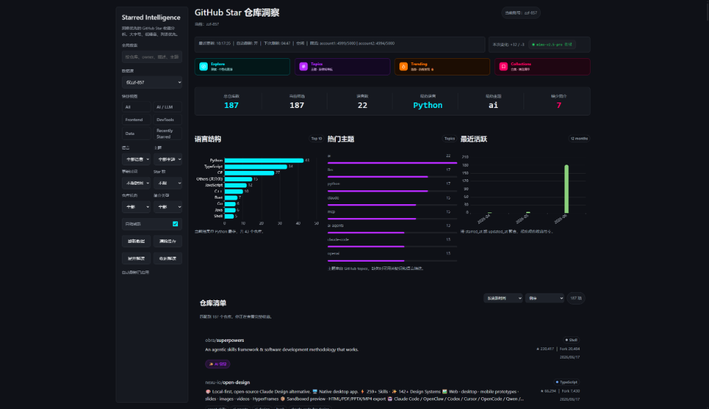
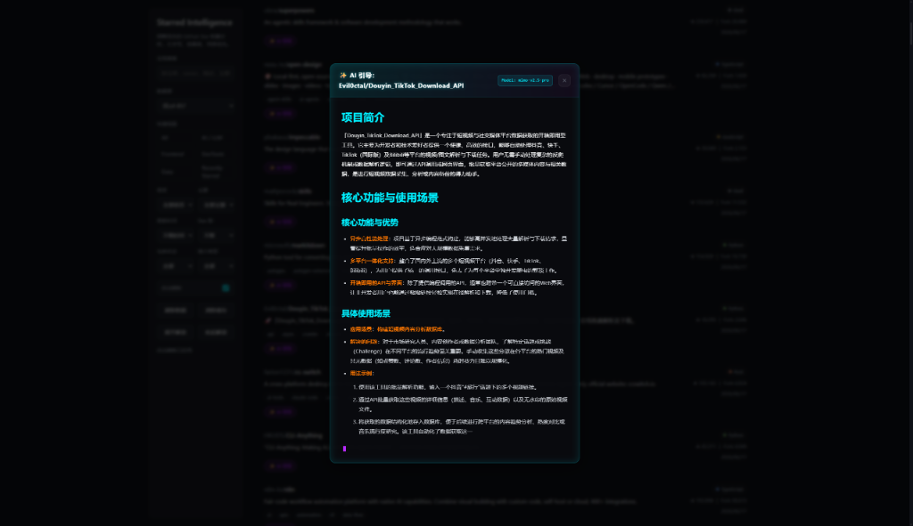

# GitHub Star 仓库洞察 (GitHub Star Warehouse Insights)

一个本地运行的 GitHub Star 仓库洞察与整理工具。它可以合并、整理多个 GitHub 账号的收藏仓库，提供丰富的图表与多维度的筛选条件，并结合 AI 技术帮助你快速回顾、分析自己的技术收藏。

---

## 📸 界面预览

### 项目数据看板


### AI 智能引导与分析


---

## ✨ 核心特性

- **多账号数据合并**：支持从 `.env` 配置文件读取多个 GitHub 账号的 Token，合并展示所有 Star 仓库，支持多账号合并或单账号切片分析。
- **多维度筛选与检索**：
  - **搜索**：支持对仓库名、所有者（Owner）、描述、主题进行全局搜索。
  - **快捷分类**：内置 `AI / LLM`、`Frontend`、`DevTools`、`Data` 以及 `Recently Starred` 等常用快捷分类标签。
  - **进阶过滤**：支持根据编程语言、热门主题（Topics）、更新时间范围、Star 数量区间、是否包含简介/README 等条件进行精细化过滤。
- **直观的数据可视化**：
  - **关键指标看板**：展示总仓库数、筛选匹配数、语言数、主要活跃语言、极少简介数等。
  - **语言结构图表**：清晰直观的 Top 10 语言比例横向柱状图。
  - **热门主题词云/列表**：提炼最常关注的 GitHub topics 标签。
  - **活跃趋势折线图**：展示近 12 个月的 Star/更新时间活跃趋势。
- **AI 智能代理与引导**：
  - 本地 `server.py` 充当静态文件服务器与 AI API 代理。
  - 一键对选定仓库进行 AI 分析，自动提取并精简 README，解析生成“项目简介”、“核心功能与优势”、“具体使用场景”和“用法示例”等信息。
  - 完美支持 OpenAI 兼容接口（如 GPT、Claude、火山引擎方舟等大模型），支持流式传输（Streaming）和实时取消请求。
- **安全与性能**：
  - 本地缓存机制，支持快速加载与手动/自动刷新，避免频繁触发 GitHub API 速率限制（Rate Limit）。
  - Token 及 API 密钥仅在本地 `.env` 及本地服务中流转，安全可靠。

## 🛠️ 项目架构与文件说明

```text
GitHub_AccountInfoViewer/
├── starred_repos_dashboard.html  # 数据看板前端主页面与样式 (CSS/HTML)
├── server.py                     # 本地 Python 轻量服务，兼做静态服务器及 AI 代理
├── js/
│   ├── app.js                    # 看板入口、账号载入、自动刷新与事件监听
│   ├── github-api.js             # 负责 GitHub Star 数据的拉取、合并与归一化
│   ├── insights.js               # 核心纯逻辑层：数据过滤、指标统计、图表数据处理等
│   ├── store.js                  # 前端状态管理器 (State Management)
│   ├── view.js                   # 页面元素渲染与交互逻辑
│   └── refresh-controller.js     # 自动刷新控制器
├── docs/
│   └── images/                   # 存放 README 预览图片的目录
│       ├── dashboard.png         # 看板预览图
│       └── ai_guide.png          # AI 引导对话框预览图
└── tests/                        # 自动化测试目录（包含 Python 契约测试与 JS 逻辑测试）
```

## 🚀 快速开始

### 1. 环境准备

- 安装 Python 3.x
- 使用现代主流浏览器访问
- （可选）若要运行 JavaScript 测试，需安装 Node.js

### 2. 配置环境

在项目根目录下创建一个 `.env` 文件（已在 `.gitignore` 中忽略，确保凭证安全），内容模板如下：

```env
# GitHub 账号配置 (支持多账号)
ACCOUNT_1_NAME=主账号
ACCOUNT_1_TOKEN=your_github_personal_access_token_1
ACCOUNT_2_NAME=备用账号
ACCOUNT_2_TOKEN=your_github_personal_access_token_2

# AI 模型代理配置 (可选，不配置则进入 AI 模拟模式)
AI_API_KEY=your_llm_api_key
AI_API_BASE=https://api.openai.com/v1
AI_MODEL=gpt-4o-mini
```

> [!TIP]
> - GitHub Personal Access Token 仅需最基础的公共数据读取权限即可。
> - `AI_API_BASE` 支持任何兼容 OpenAI 接口标准的 API 服务商（如 DeepSeek、月之暗面、火山引擎等）。

### 3. 运行服务

双击运行启动脚本或在终端中执行：

* **Windows 批处理启动（推荐）**：
  ```powershell
  .\start_server.bat
  ```
* **手动命令启动**：
  ```powershell
  python server.py 8000
  ```

启动后，在浏览器中打开以下地址即可使用：
```text
http://127.0.0.1:8000/starred_repos_dashboard.html
```

要停止服务，可运行 `.\stop_server.bat` 或在终端中按 `Ctrl+C` 中断。

### 4. 运行测试

* **运行 Python 后端/契约测试**：
  ```powershell
  python -m unittest discover -s tests
  ```
* **运行 JS 纯逻辑层测试**：
  ```powershell
  node tests/js/insights.test.js
  ```

## ⚠️ 注意事项

1. **安全性**：当前工具为本地运行设计。请勿将包含真实 Token/API Key 的 `.env` 文件或项目直接部署到公网服务器，以防密钥泄露。
2. **速率限制**：初次同步大量 Star 仓库时，请注意 GitHub API 速率限制。工具内置了缓存机制，后续打开将优先使用缓存。
3. **隐私提示**：使用 AI 引导功能时，工具会将当前选中仓库的名称、简介以及 README 内容发送至你配置的 AI API 服务端。
